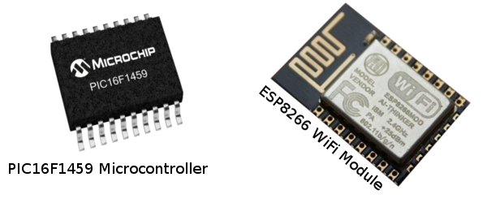
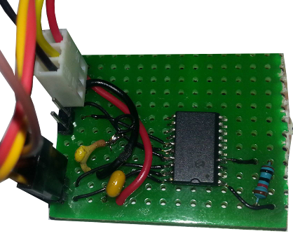

# ZyloDucky

The ZyloDucky is a usb hardware key injector, that work a little bit like this:

* Stick it into a USB port on the computer you wish to inject keypresses into
* Share your phones internet, for the ZyloDucky to use, or configure with other AP creds.
* ZyloDucky use the available wifi connection to connect to a preconfigured irc server / channel
* From the IRC channel you can control the ZyloDucky to make it inject whatever you please,
  whenever.

There are several parts that goes into making a ZyloDucky, the major parts are as follows
and will be explained further in their own sections.

* **Hardware**, what microcontroller, wifi module ,what other discrete components and how its
put together
* **Microcode**, the programming on the microcontrollers, irc bot software etc.
* **Support Programs**, program to convert text,actions to scancodes, delays.
* **Ducky Language**, simple declarative language to instruct the ZD on what to type

## Hardware

The hardware for the ZyloDucky should be cheap and build with a minimum of components,
in order to keep the price tag down and also to be able to get a low footprint.

I have choosen to use a PIC micro controller for the unit which handles the USB communication,
they are both cheap and versatile, and a very small amount of additional circuitry is
needed in order for them to handle their task.

The model i have choosen is a PIC16F1459, its an 8 bit microcontroller with build in
USB capabilities. The oscilator inside the chip is precise enough to handle the USB
communication without the need for an external crystal, which is good in terms of footprint.

It operate at a voltage range from 2.3V to 5.5V which means it can run directly from the
usb power. However as we build this device with Wireless capabilities, we will need to
step down the voltage from the USB so it will match the WiFi modules 3.3v requirement.

The WiFi module will be a module based on the Espressif ESP8266 platform.
Its got a full tcp/ip stack build in along with UART (serial comms), which we will use
for communicating with the PIC micro.

The ESP8266 will also house the ZyloBot c irc bot, which is a minimal irc client build
into the micro controller.

The ESP8266 is very overkill for this projects in terms of the power of its build in
microcontroller, the amount of ram is insane in microcontroller circles and its running
at a whopping 60mhz. (the PIC is running at 8mhz).

We use it for its WiFi capabilities and its low cost (around $3), also we build
in the irc bot as it makes more sense to have it on the wifi module than on the pic.
We don't have room for large buffers on the pics 1024bytes of ram !

The general flow is as follows:

* WifI module ESP8266 connects to wifi.
* Wifi module connects to IRC on a predefined server/channel
* When the wifi module gets PRIVMSG'd with certain commands, it encode the string
  message to something easy for the PIC to understand and communicate this via
  serial port communications to the PIC (UART).
* The pic will translate the received commands to keyboard scan codes and send
  this out via usb hid.

### BOM (bill of materials)

 * PIC16F1459
 * ESP8266-12E Wireless transciever module
 * Stripboard / Veroboard
 * 

### How its put together

The prototype has been put together on a stripboard/veroboard in order to facilitate
a quick and cheap process from idea to working product.

The PIC16F1459 was ordered in SOIC format, that is for use as a surfacemount component,
it makes it a bit harder to solder manually, but its doable with some patience.

